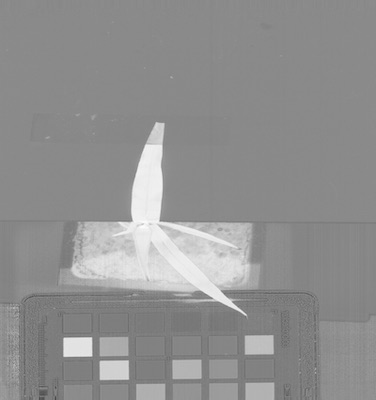
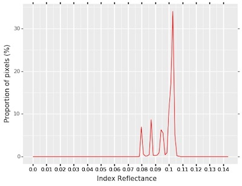

## Analyze a Hyperspectral Index

This function calculates the hyperspectral index statistics and writes the values  as observations out to
       the [Outputs class](outputs.md).
       
**plantcv.hyperspectral.analyze_index**(*index_array, mask, bins=100, min_bin=None, max_bin=None*)

**returns** None

- **Parameters:**
    - index_array   - instance of the `Spectral_data` class (created by running [pcv.hyperspectral.extract_index](extract_index.md))
    - mask          - Binary mask made from selected contours
    - histplot      - If True plots histogram of intensity values
    - bins          - Optional, number of classes to divide spectrum into (default bins=100) 
    - min_bin       - Optional, maximum bin label. If `None` then 0 will be used for the smallest bin label.
    - max_bin       - Optional, maximum bin label. If `None` then maximum pixel value detected in the image will be used for the largest bin label.

- **Context:**
    - Calculates data about mean, median, and standard deviation of an input index within a masked region. 
- **Example use:**
    - Below
- **Output data stored:** Mean, median, and standard deviation of the index automatically gets stored to the 
    [`Outputs` class](outputs.md) when this function is ran. 
    These data can always get accessed during a workflow (example below). For more detail about data output see [Summary of Output Observations](output_measurements.md#summary-of-output-observations)


```python

from plantcv import plantcv as pcv

pcv.hyperspectral.analyze_index(index_array=ndvi_index, mask=leaf_mask, histplot=True, bins=100)

```

*NDVI Index Image* 




*Masked Index Histogram*



**Source Code:** [Here](https://github.com/danforthcenter/plantcv/blob/master/plantcv/plantcv/hyperspectral/analyze_index.py)
