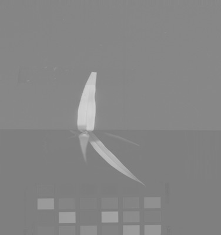

## Extract Index 

This function extracts an index from a hyperspectral datacube, which is a [`Spectral_data` class](Spectral_data.md) instance created while reading in with [readimage](read_image.md)
with `mode='envi'`. There is also a parameter to allow some flexibility 
on using wavelengths that are at least close to the wavelength bands require to calculate a specific index. 

**plantcv.hyperspectral.extract_index**(*array, index="NDVI", distance=20*)

**returns** calculated index array (instance of the `Spectral_data` class)

- **Parameters:**
    - array         - A hyperspectral datacube object, an instance of the `Spectral_data` class, (read in with [pcv.readimage](read_image.md) with `mode='envi'`)
    - index         - Desired index, either "ndvi" for normalized difference vegetation index, "gdvi" for green difference
    vegetation index, or "savi" for soil adjusted vegetation index.
    - distance      - Amount of flexibility (in nanometers) regarding using wavelengths that are 
    at least close to the wavelength bands require to calculate a specific index

- **Note:**
    - We are adding potential indices as needed by PlantCV contributors, however the functions added to PlantCV are shaped in large part 
    by the end users so please post feature requests (including a specific index), questions, and comments on the 
    [GitHub issues page](https://github.com/danforthcenter/plantcv/issues). 
- **Example use:**
    - Below
```python

from plantcv import plantcv as pcv

# Set global debug behavior to None (default), "print" (to file), 
# or "plot" (Jupyter Notebooks or X11)
pcv.params.debug = "print"

# Extract NDVI index from the datacube 
ndvi_array  = pcv.hyperspectral.extract_index(array=spectral_data, index="NDVI", distance=20)

```

**NDVI array image**


**GDVI array image**



**SAVI array image**


