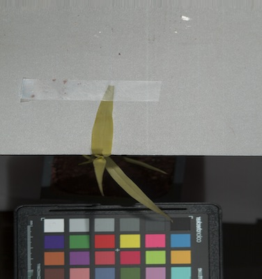
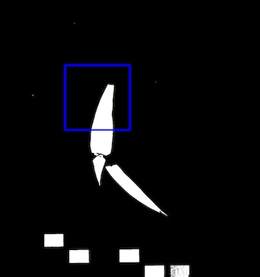
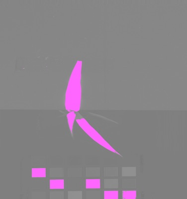

## Tutorial: Hyperspectral Image Workflow

PlantCV is composed of modular functions that can be arranged (or rearranged) and adjusted quickly and easily.
Workflows do not need to be linear (and often are not). Please see workflow example below for more details.
A global variable "debug" allows the user to print out the resulting image. The debug has three modes: either None, 'plot', or 'print'.
If set to 'print' then the function prints the image out, or if using a [Jupyter](jupyter.md) notebook you could set debug to 'plot' to have
the images plot to the screen. Debug mode allows users to visualize and optimize each step on individual test images and small test sets before workflows are deployed over whole datasets.

Coming soon: interactive Hyperspectral tutorial! 

Also see [here](#Hyperspectral-script) for the complete script. 

**Workflow**

1.  Optimize workflow on individual image with debug set to 'print' (or 'plot' if using a Jupyter notebook).
2.  Run workflow on small test set (that ideally spans time and/or treatments).
3.  Re-optimize workflows on 'problem images' after manual inspection of test set.
4.  Deploy optimized workflow over test set using parallelization script.

**Running A Workflow**

To run a hyperspectral workflow over a single hyperspectral image there are two required inputs:

1.  **Image:** ENVI type hyperspectral images are currently compatible with PlantCV, however the functions added to PlantCV are shaped in large part 
by the end users so please post feature requests, questions, and comments on the 
[GitHub issues page](https://github.com/danforthcenter/plantcv/issues). 
2.  **Output directory:** If debug mode is set to 'print' output images from each step are produced, otherwise ~4 final output images are produced.

**Optional inputs:**

*  **Result File:** File to print results to
*  **Write Image Flag:** Flag to write out images, otherwise no result images are printed (to save time).
*  **Debug Flag:** Prints an image at each step
*  **Region of Interest:** The user can input their own binary region of interest or image mask (make sure it is the same size as your image or you will have problems).

Sample command to run a workflow on a single image:  

*  Always test workflows (preferably with -D flag set to 'print') before running over a full image set

```
./workflowname.py -i testimg.png -o ./output-images -r results.txt -w -D 'print'

```

### Walk Through A Sample Workflow

#### Workflows start by importing necessary packages, and by defining user inputs.

```python

#!/usr/bin/python
import sys, traceback
import cv2
import numpy as np
import argparse
from plantcv import plantcv as pcv

### Parse command-line arguments
def options():
    parser = argparse.ArgumentParser(description="Imaging processing with opencv")
    parser.add_argument("-i", "--image", help="Input image file.", required=True)
    parser.add_argument("-o", "--outdir", help="Output directory for image files.", required=False)
    parser.add_argument("-r","--result", help="result file.", required= False )
    parser.add_argument("-w","--writeimg", help="write out images.", default=False, action="store_true")
    parser.add_argument("-D", "--debug", help="can be set to 'print' or None (or 'plot' if in jupyter) prints intermediate images.", default=None)
    args = parser.parse_args()
    return args
    
```

#### Start of the Main/Customizable portion of the workflow.

The image input by the user is [read in](read_image.md).

```python

### Main workflow
def main():
    # Get options
    args = options()
    
    pcv.params.debug=args.debug #set debug mode
    pcv.params.debug_outdir=args.outdir #set output directory
    
    # Read image (readimage mode defaults to native but if image is RGBA then specify mode='rgb')
    # Inputs:
    #   filename - Image file to be read in 
    #   mode     - Return mode of image; either 'native' (default), 'rgb', 'gray', 'envi', or 'csv'
    spectral_array = pcv.readimage(filename=args.image, mode='envi')
    
    filename = spectral_array.filename
    
    # Save the pseudo-rgb image that gets created while reading in hyperspectral data
    pcv.print_image(img=spectral_array.pseudo_rgb, filename=filename + "_pseudo-rgb.png")
    
```

**Figure 1.** Psuedo-RGB image from hyperspectral datacube.
The picture in this tutorial we use is a HEADWALL Hyperspec ENVI Standard image. Reading an hyperspectral image in with PlantCV will also create a pseudo-RGB image 
based on the wavelengths available in order to confirm that image data has been read in successfully. This creates an instance of the `Spectral_data` class so the 
object returned has many methods that are useful to users and within PlantCV functions. 



```python        
    # Extract the Green Difference Vegetation Index from the datacube 
    
    # Inputs:
    #   array        - Hyperspectral data instance  
    #   index        - Index of interest
    #   fudge_factor - How lenient to be if the required wavelengths 
    #                  for a specific index are not available 
    index_array_gdvi = pcv.hyperspectral.extract_index(array=spectral_array, 
                                                       index="GDVI",
                                                       fudge_factor=20)
                                                       
```

**Figure 2.** GDVI Grayscale Image
For this image the Green Difference Vegetation Index was ideal for separating the leaf of interest from the rest of the background. 


```python
    # Threshold the grayscale image 
    
    # Inputs:
    #   gray_img    - Grayscale image data 
    #   threshold   - Threshold value (between 0-255)
    #   max_value   - Value to apply above threshold (255 = white) 
    #   object_type - 'light' (default) or 'dark'. If the object is lighter than the 
    #                 background then standard threshold is done. If the object is 
    #                 darker than the background then inverse thresholding is done. 
    gdvi_thresh = pcv.threshold.binary(gray_img=index_array_gdvi.array_data, threshold=150, max_value=255)
    
```

**Figure 3.** Thresholded GDVI Image
Use the grayscale GDVI image to create a mask for the leaf of interest. Take a binary threshold. 
 


```python
    # Define ROI 
    
    # Inputs: 
    #   img - RGB or grayscale image to plot the ROI on 
    #   x   - The x-coordinate of the upper left corner of the rectangle 
    #   y   - The y-coordinate of the upper left corner of the rectangle 
    #   h   - The height of the rectangle 
    #   w   - The width of the rectangle 
    roi, roi_hierarchy= pcv.roi.rectangle(img=gdvi_thresh, x=400, y=400, h=400, w=400)
    
``` 

**Figure 4.** Define a rectangular Region of Interest 
Draw a rectangular ROI around the leaf of interest. 
 


```python
    # 
    
    # Inputs: 
    #   img  - RGB or grayscale image data for plotting 
    #   mask - Binary mask used for detecting contours 
    id_objects, obj_hierarchy = pcv.find_objects(img=index_array_gdvi.array_data, mask=gdvi_thresh)
    
``` 

**Figure 5.** Identify objects 
Identify objects in the mask that was created. 



```python
    # 
    
    
    # Inputs:
    #    img            - img to display kept objects
    #    roi_contour    - contour of roi, output from any ROI function
    #    roi_hierarchy  - contour of roi, output from any ROI function
    #    object_contour - contours of objects, output from pcv.find_objects function
    #    obj_hierarchy  - hierarchy of objects, output from pcv.find_objects function
    #    roi_type       - 'partial' (default, for partially inside), 'cutto', or 
    #                     'largest' (keep only largest contour)
    roi_objects, hierarchy, kept_mask, obj_area = pcv.roi_objects(img=index_array_gdvi.array_data, roi_contour=roi, 
                                                                  roi_hierarchy=roi_hierarchy, 
                                                                  object_contour=id_objects, 
                                                                  obj_hierarchy=obj_hierarchy,
                                                                  roi_type='partial')
                                                               
``` 

**Figure 6.** Binary Mask 
Binary mask after filtering objects by the region of interest that we defined. 


## Hyperspectral Script
In the terminal:

```
./workflowname.py -i testimg.png -o ./output-images -r results.txt -w -D 'print'

```
*  Always test workflows (preferably with -D flag set to 'print') before running over a full image set

Python script: 

```python
# !/usr/bin/python
import sys, traceback
import cv2
import numpy as np
import argparse
import string
from plantcv import plantcv as pcv


### Parse command-line arguments
def options():
    parser = argparse.ArgumentParser(description="Imaging processing with opencv")
    parser.add_argument("-i", "--image", help="Input image file.", required=True)
    parser.add_argument("-o", "--outdir", help="Output directory for image files.", required=False)
    parser.add_argument("-r", "--result", help="result file.", required=False)
    parser.add_argument("-w", "--writeimg", help="write out images.", default=False, action="store_true")
    parser.add_argument("-D", "--debug",
                        help="can be set to 'print' or None (or 'plot' if in jupyter) prints intermediate images.",
                        default=None)
    args = parser.parse_args()
    return args

#### Start of the Main/Customizable portion of the workflow.

### Main workflow
def main():
    # Get options
    args = options()

    pcv.params.debug = args.debug  # set debug mode
    pcv.params.debug_outdir = args.outdir  # set output directory

    # Read image
    array_data = pcv.readimage(filename=args.image, mode='envi')

    # Write shape and color data to results file
    pcv.print_results(filename=args.result)

if __name__ == '__main__':
    main()
    
```
