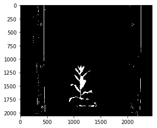
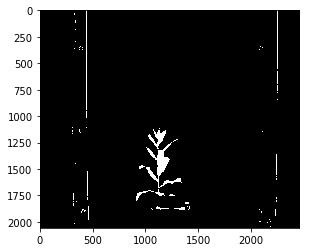

## Opening

Filters out bright noise from an image.

**plantcv.opening**(*gray_img, kernel=None*)

**returns** filtered_img

- **Parameters:**
    - gray_img - Grayscale or binary image data
    - kernel - Optional neighborhood, expressed as an array of 1's and 0's. See the [kernel making](get_kernel.md) function. If None, 
    use cross-shaped structuring element.
  - **Context:**
    - Used to reduce image noise, specifically small bright spots (i.e. "salt").
- **Example use:**
    - See below

```python

from plantcv import plantcv as pcv

# Set global debug behavior to None (default), "print" (to file), or "plot" (Jupyter Notebooks or X11)
pcv.params.debug = "print"

# Apply opening
filtered_img = pcv.opening(gray_img=gray_img)

```

**Grayscale image**



**Opening**



In addition to the [kernel making](get_kernel.md) function users can create custom kernel shapes. 
```python

from plantcv import plantcv as pcv
import numpy as np

# Set global debug behavior to None (default), "print" (to file), or "plot" (Jupyter Notebooks or X11)
pcv.params.debug = "print"

# Apply opening with an X-shaped kernel 
filtered_img = pcv.opening(gray_img=gray_img, kernel=np.array([[1, 0, 1], [0, 1, 0], [1, 0, 1]]))

```