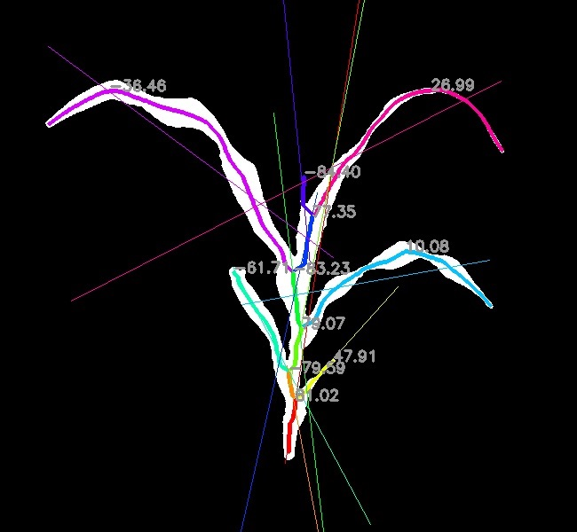

## Measure Segment Angles

Measure angles of segments. 

**plantcv.morphology.segment_angle**(*segmented_img, objects*)

**returns** labeled image   

- **Parameters:**
    - segmented_img - Segmented image (output either from [plantcv.morphology.segment_skeleton](segment_skeleton.md)
    or [plantcv.morphology.segment_id](segment_id.md)), used for creating the labeled image. 
    - objects - Segment objects (output from either [plantcv.morphology.segment_skeleton](segment_skeleton.md), or
    [plantcv.morphology.segment_sort](segment_sort.md)).
- **Context:**
    - Calculates angles of segments (in degrees) by fitting a linear regression line to each segment. Users can pass only 
    leaf objects (returned from [plantcv.morphology.segment_sort](segment_sort.md)) to only collect angles of leaves. 
    The measure of angles automatically gets stored in the [outputs class](outputs.md). 

**Reference Image:** segmented_img 


```python

from plantcv import plantcv as pcv

# Set global debug behavior to None (default), "print" (to file), 
# or "plot" (Jupyter Notebooks or X11)
pcv.params.debug = "print"

labeled_img = pcv.morphology.segment_angle(segmented_img=segmented_img, objects=obj)

```

*Labeled Image*


