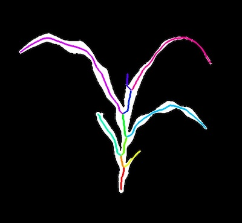

## Measure Path Length of Segments

**plantcv.morphology.segment_path_length**(*segmented_img, objects*)

**returns** Labeled image, list of segment angles

- **Parameters:**
    - segmented_img - Segmented image (output from [plantcv.morphology.segment_skeleton](segment_skeleton.md)), used for creating the labeled image.
    - objects - Segment objects (output from either [plantcv.morphology.segment_skeleton](segment_skeleton.md), or
    [plantcv.morphology.segment_sort](segment_sort.md))
- **Context:**
    - Calculates geodesic length of segments. Users can pass only leaf objects (returned from
    [plantcv.morphology.segment_skeleton](segment_skeleton.md)) to only collect angles of leaves.

**Reference Images**




```python

from plantcv import plantcv as pcv

# Set global debug behavior to None (default), "print" (to file),
# or "plot" (Jupyter Notebooks or X11)
pcv.params.debug = "print"

# Adjust line thickness with the global line thickness parameter (default = 5),
# and provide binary mask of the plant for debugging. NOTE: the objects and
# hierarchies returned will be exactly the same but the debugging image will look different.
pcv.params.line_thickness = 3

labeled_img, segment_angles = pcv.morphology.segment_path_length(segmented_img=segmented_img, objects=obj)

```

*Labeled Image*


