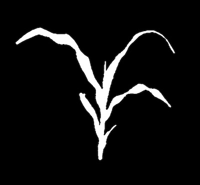
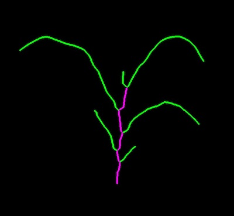
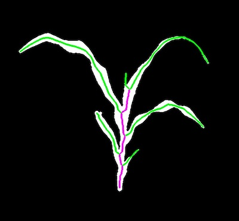

## Sort Segments

**plantcv.morphology.segment_sort**(*skel_img, objects, hierarchies, mask=None*)

**returns** Leaf segment objects, leaf segment object hierarchies, other segment objects, other segment object hierarchies 

- **Parameters:**
    - skel_img - Skeleton image (output from [plantcv.morphology.skeletonize](skeletonize.md))
    - objects - Segment objects (output from [plantcv.morphology.segment_skeleton](segment_skeleton.md))
    - hierarchies - Segment object hierarchies (output from [plantcv.morphology.segment_skeleton](segment_skeleton.md))
    - mask - Binary mask for debugging. If provided, debug image will be overlaid on the mask.
- **Context:**
    - Sorts skeleton segments into two categories: leaf segments and other segments. Leaf segments get 
    colored green and other segments get colored fuschia. 

**Reference Images**




```python

from plantcv import plantcv as pcv

# Set global debug behavior to None (default), "print" (to file), 
# or "plot" (Jupyter Notebooks or X11)
pcv.params.debug = "print"

# Adjust line thickness with the global line thickness parameter (default = 5),
# and provide binary mask of the plant for debugging. NOTE: the objects and
# hierarchies returned will be exactly the same but the debugging image will look different.
pcv.params.line_thickness = 3 

leaf_obj, leaf_hier, other_obj, other_hier = pcv.morphology.segment_sort(skel_img=skeleton,
                                                                         objects=obj,
                                                                         hierarchies=hier)

leaf_obj, leaf_hier, other_obj, other_hier = pcv.morphology.segment_sort(skel_img=skeleton,
                                                                         objects=obj,
                                                                         hierarchies=hier, 
                                                                         mask=plant_mask)

```

*Segmented Image without Mask*



*Segmented Image with Mask*

