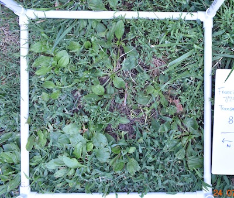

## Standard Deviation Filter 

Creates a grayscale image of pixelwise standard deviation from a grayscale image.


**plantcv.stdev_filter(*gray_img, ksize, borders='nearest'*)**

**returns** stdev image

- **Parameters:**
    - gray_img - Grayscale image data
    - ksize - Kernel size for texture measure calculation
    - borders - How the array borders are handled, either ‘reflect’, ‘constant’, ‘nearest’ (default), ‘mirror’, or ‘wrap’
- **Note:**
    - This function is computationally expensive than other filters and will likely take several moments to run (even longer if images are large).
- **Example use:**
    - Below

**Original image **


```python

from plantcv import plantcv as pcv

# Set global debug behavior to None (default), "print" (to file), 
# or "plot" (Jupyter Notebooks or X11)

pcv.params.debug = "print"

# Create binary image from a gray image based on texture values.
texture_img_11 = pcv.stdev_filter(gray_img=gray_img, ksize=11, borders='nearest')
texture_img = pcv.stdev_filter(gray_img=gray_img, ksize=11, borders='nearest)
texture_img_111 = pcv.stdev_filter(gray_img=gray_img, ksize=111, borders='nearest)

                                    
```

**Original image**



**Standard deviation image (ksize=11)**


**Standard deviation image (ksize=111)**


**Source Code:** [Here](https://github.com/danforthcenter/plantcv/blob/master/plantcv/plantcv/stdev_filter.py)
